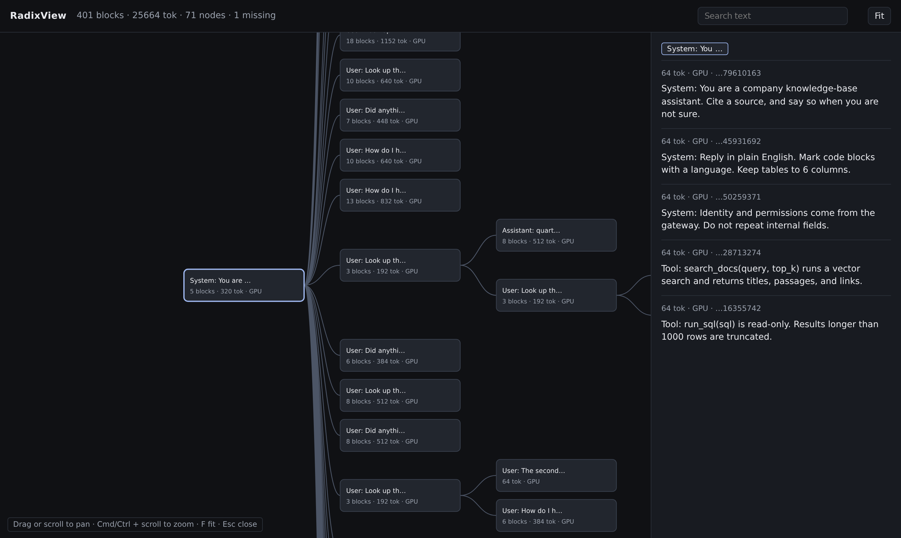

# RadixView

RadixView shows the KV cache of a running [SGLang](https://github.com/sgl-project/sglang) server. It subscribes to the server's ZMQ event stream, logs every block the server stores or evicts, and draws the resulting radix tree as a web page at `http://<host>:8765`.

A block is the unit a KV event reports: `page_size` tokens, multiplied by `dcp_size` when decode context parallelism is on.

RadixView can run on a different machine from the GPU server. It does not route requests, and it does not read the server's radix tree in-process.



## Install

Python 3.10 or newer. From a checkout:

```bash
pip install -e .
```

This installs the `radixview` command.

## Try the demo

No GPU and no model required:

```bash
python -m examples.demo
```

Open `http://127.0.0.1:8765`, or `http://<host>:8765` from another machine. The demo fills the tree with synthetic agent traffic: one shared system prompt, many sessions, a few regenerated turns, and eviction once the cache is full.

| Option | Default | Meaning |
| --- | --- | --- |
| `--blocks` | `400` | How many blocks the cache keeps |
| `--port` | `8765` | Port for the page. `0` picks a free port |

Prompt text for the demo is in `examples/demo/corpus.json`, and the generator is `examples/demo/traffic.py`. The library imports neither.

## Watch an SGLang server

Start SGLang with KV events bound on a wildcard host such as `*`:

```bash
python -m sglang.launch_server \
  --model-path MODEL_PATH \
  --kv-events-config '{"publisher":"zmq","endpoint":"tcp://*:5557"}'
```

SGLang binds its publisher only on a wildcard host. With a concrete host such as `tcp://127.0.0.1:5557` it connects out instead, nothing can subscribe to it, and RadixView exits with a hint.

Then, from this machine or another one that can reach the server:

```bash
radixview --server http://GPU_HOST:30000
```

| Option | Default | Meaning |
| --- | --- | --- |
| `--server` | `http://127.0.0.1:30000` | Base URL of the SGLang HTTP server |
| `--api-key` | none | Needed when SGLang was started with `--api-key` |
| `--view-port` | `8765` | Port for the page, on every interface. `0` picks a free port |

Open `http://<the host running RadixView>:8765`.

RadixView reads `/server_info` to find one ZMQ endpoint per data-parallel (DP) rank, and turns stored token ids back into text through the server's `/detokenize` endpoint. The machine running RadixView must reach:

- `GPU_HOST:30000`, the SGLang HTTP port.
- `GPU_HOST:5557` up to `5557 + dp_size - 1`, one ZMQ port per DP rank.

Each event is logged like this, shown without the timestamp and logger name:

```text
dp=0 seq=42 stored blocks=1 tokens=64 block_size=64 medium=GPU parent=1137640873890580499 hash=-2285270490815386373
  User: How do I handle GPU quota?
dp=0 seq=43 removed blocks=2 medium=GPU hashes=[-2285270490815386373, 5188292320627455716]
dp=0 seq=44 cleared
```

A skipped sequence number is logged as a gap. A sequence number that goes backwards is logged as a publisher restart.

Start RadixView before the traffic you care about, or restart SGLang after RadixView is up. Blocks stored before RadixView subscribed are not in the stream. Their descendants hang off a dashed placeholder node.

## Security

The ZMQ events carry prompt token ids, and the page serves the decoded prompt text. Neither is encrypted or authenticated, and the page listens on every interface. Keep the ZMQ ports and `--view-port` on a trusted network.

## Reading the page

The tree reads left to right, like a prompt. A straight chain of blocks collapses into one node; every branch point starts a new node. Each node shows the start of its text, then its block count, token count, and storage medium (such as `GPU` or `CPU_PINNED`).

Click a node to open the side panel. It shows the path from the root and the full text of every block in the node. The search box matches the full block text, not only the preview. Search hits are outlined in green, and the selected node and its path from the root in blue.

Drag or scroll to pan. Cmd/Ctrl + scroll zooms. `F` fits the whole tree. `Esc` closes the side panel.

## Development

```bash
pip install -e ".[dev]"
pre-commit install
pre-commit run --all-files
python -m unittest discover -s tests
```

Style follows SGLang: Apache-2.0 file headers, ruff format at line length 88, isort with the black profile, and ruff rules `F401`, `F821`, `F823`, and `UP037`. Ruff's `C901` keeps every function's cyclomatic complexity below 10.

The page tests run under Node, through `tests/test_web.py`, on snapshots generated from the demo. They are skipped when `node` is not installed. Running the page itself does not need Node.

| Path | Contents |
| --- | --- |
| `radixview/cli.py`, `config.py` | The `radixview` command and its options |
| `radixview/discover.py` | Finding ZMQ endpoints in `/server_info` |
| `radixview/fetch.py` | HTTP requests to SGLang. Loopback hosts skip `http_proxy` |
| `radixview/wire.py` | Decoding an event batch and formatting the log line |
| `radixview/subscribe.py` | The ZMQ subscriber |
| `radixview/text.py` | `/detokenize` |
| `radixview/tree.py` | The radix tree built from events |
| `radixview/server.py` | The page and `/api/*` |
| `radixview/serve.py` | Wiring the subscriber, the tree, and the page together |
| `radixview/web/` | The page. No build step. Labels are in `web/js/format.mjs` |
| `examples/demo/` | Synthetic traffic. Not part of the library |
| `tests/` | Python tests. `tests/web/` tests the page modules |

`radixview/web/js/layout.mjs`, `viewport.mjs`, and `render.mjs` are pure and have no DOM. `main.mjs` wires them to the page.

## License

Apache License 2.0. See [LICENSE](LICENSE).
